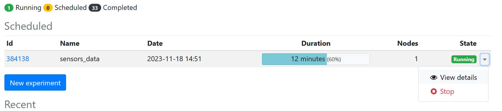
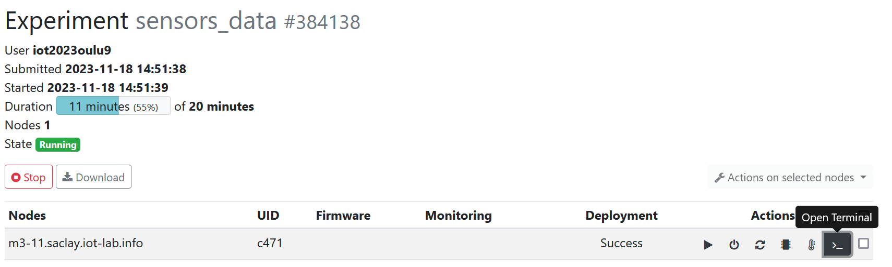

# IoT_Project

We started with the idea of developing an application for a weather station. We therefore looked for a card with temperature, pressure and luminosity sensors.
We decided to use the IOT_LAB M3 board because it contains all the sensors we need. 
With this card, we have access to a luminosity sensor (ISL29020), a pressure sensor and a temperature sensor (LPS331AP), which is exactly what we needed for our weather station application.
To develop our application we used RIOT OS on IoT-LAB.

To run the code to retrieve data from the sensors, you need to go to the Jupyter Lab server on IoT-LAB.
Next, create a folder within the riot folder. Put in the main.c and Makefile files provided in this Github folder.
Then open a terminal and go to the folder containing the main.c file.
Select an environment with the following command :
```
env SITE=grenoble
```
In our case, we have always chosen the grenoble site. You can choose: lille, paris, strasbourg, saclay.
```
iotlab-experiment submit -n "sensors_data" -d 20 -l 1,archi=m3:at86rf231+site=grenoble
```
Here the experiment will last 20 minutes. This value can be modified. Similarly, the site can be changed by modifying the value of the SITE variable in the command. 
Then write the following command:
```
iotlab-experiment wait --timeout 30 --cancel-on-timeout
```
We are waiting for the experiment to switch to "Running" status.

```
make BOARD=iotlab-m3 IOTLAB_NODE=auto flash
```

To see the results, go to the "My experiments" section on Iot-LAB.
You will get the following result:


Click on the arrow next to running and then on "View Details".
You will then get the following page:



Finally, in the "Action" section, click on "Open Terminal". You will then see the sensor values appear.
